# Charte Graphique - Vite & Gourmand

## 1. Identité de Marque
**Vite & Gourmand** est un service de traiteur haut de gamme alliant la tradition culinaire française (Julie) à l'excellence du service (José). L'identité visuelle reflète le luxe, le raffinement et l'aspect artisanal "fait maison".

---

## 2. Palette de Couleurs
Notre palette s'inspire de l'élégance classique et des vignobles bordelais.

| Couleur | Code Hex | Usage |
| :--- | :--- | :--- |
| **Bordeaux** | `#800020` | Couleur primaire, fonds de cartes, titres secondaires. |
| **Or (Gold)** | `#D4AF37` | Couleur secondaire, bordures "Baroque", icônes, boutons secondaires. |
| **Noir (Accent)** | `#000000` | Texte principal, contrastes forts. |
| **Blanc** | `#FFFFFF` | Fond de page, lisibilité. |

---

## 3. Typographie
Nous utilisons un contraste entre une police Serif prestigieuse pour les titres et une police Sans-Serif moderne pour le corps de texte.

- **Titres (H1, H2, H3)** : `Playfair Display`
  - Style : Elegant, Baroque, Lettres avec empattements.
- **Corps de texte** : `Lato`
  - Style : Moderne, Lisible, Professionnel.

---

## 4. Éléments d'Interface (UI)
- **Boutons** : Bordures carrées pour le luxe sur desktop, arrondis (pilules) pour l'ergonomie mobile.
- **Cartes** : Style Baroque avec bordures dorées et fond bordeaux.

---

## 5. Maquettes & Wireframes (Desktop 1440px)

### 🏠 Accueil
````carousel
```markdown
Structure (Wireframe)
```
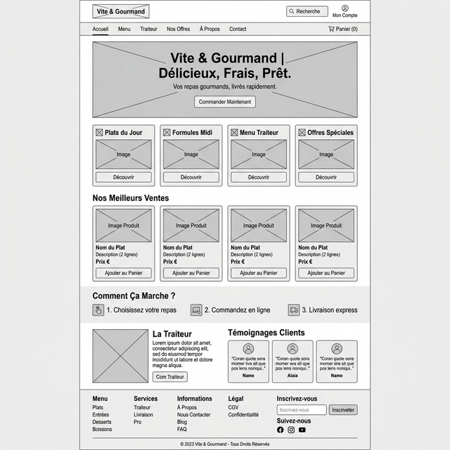
<!-- slide -->
```markdown
Rendu Haute Fidélité
```
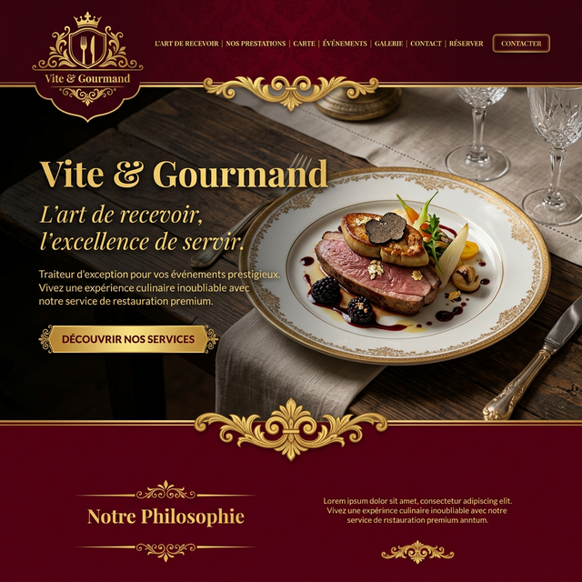
````

### 🍽️ Nos Menus
````carousel
```markdown
Structure (Wireframe)
```
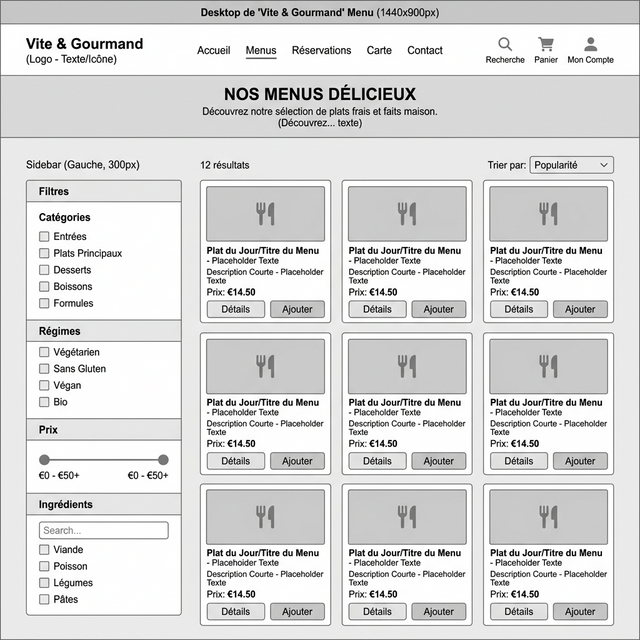
<!-- slide -->
```markdown
Rendu Haute Fidélité
```
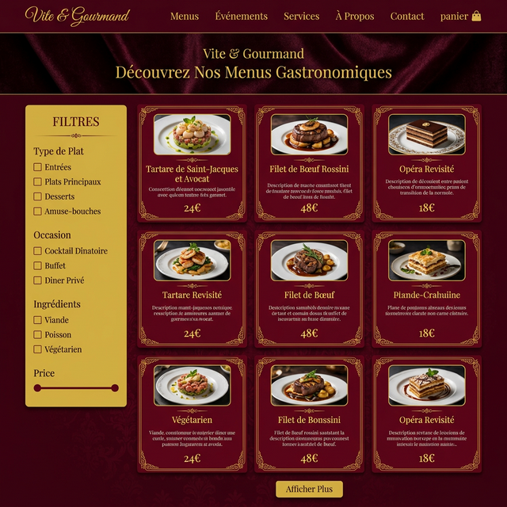
````

### ⚙️ Administration
````carousel
```markdown
Structure (Wireframe)
```
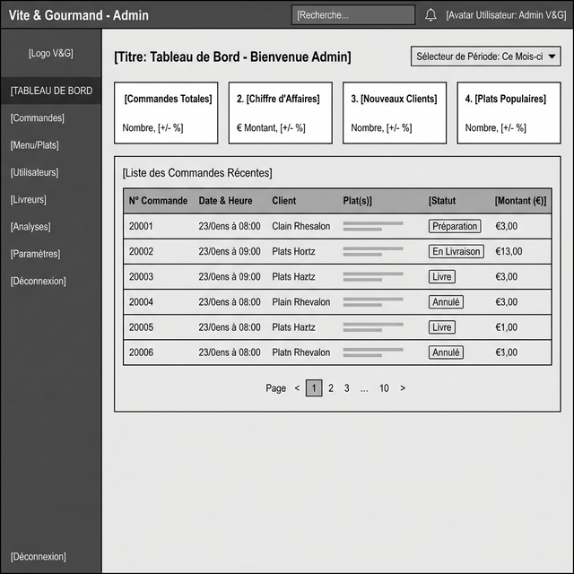
<!-- slide -->
```markdown
Rendu Haute Fidélité
```
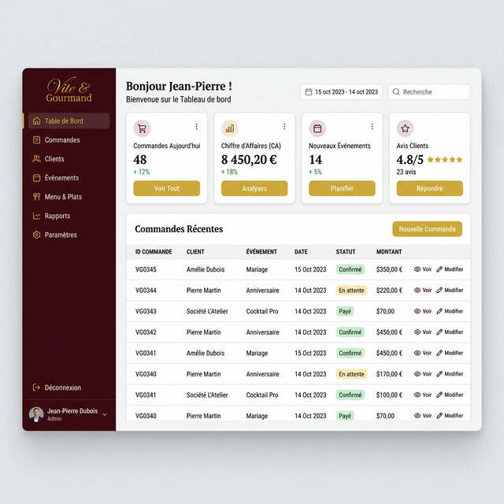
````

---

## 6. Maquettes & Wireframes (Mobile 375px)

### 🏠 Accueil
````carousel
```markdown
Structure (Wireframe)
```
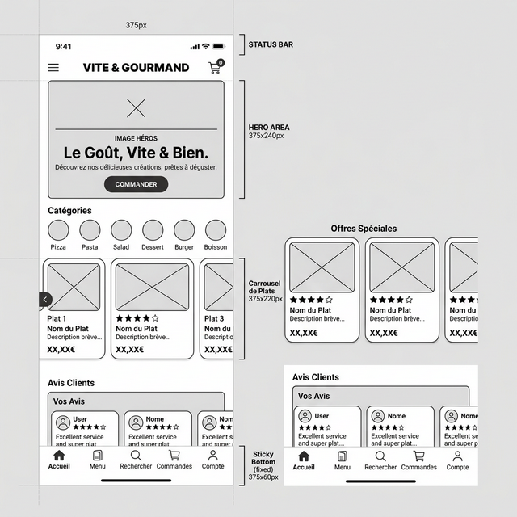
<!-- slide -->
```markdown
Rendu Haute Fidélité
```
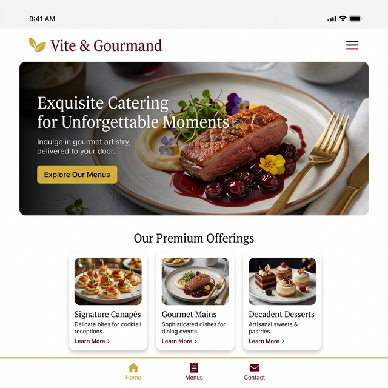
````

### 🍽️ Nos Menus
````carousel
```markdown
Structure (Wireframe)
```
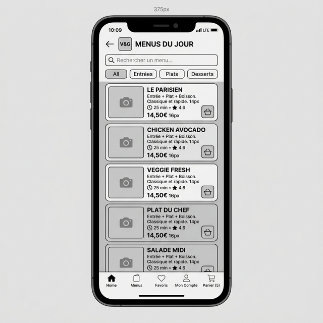
<!-- slide -->
```markdown
Rendu Haute Fidélité
```
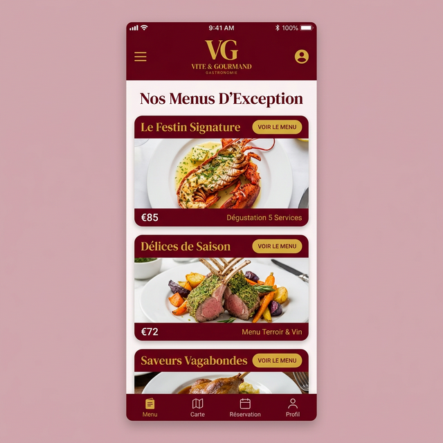
````

### ⚙️ Administration
````carousel
```markdown
Structure (Wireframe)
```
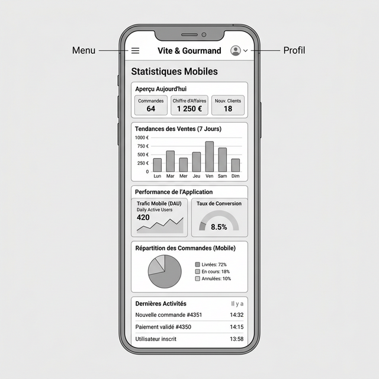
<!-- slide -->
```markdown
Rendu Haute Fidélité
```
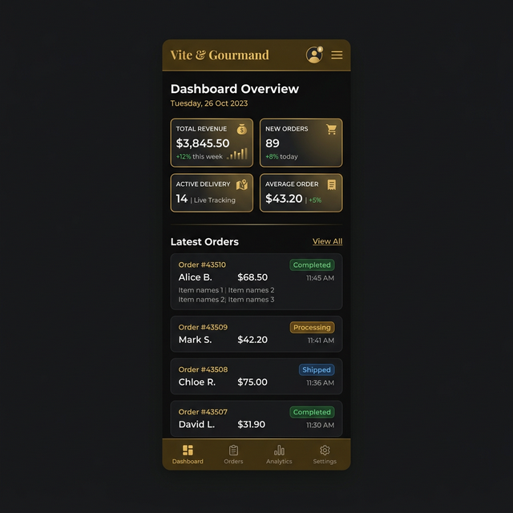
````

---

## 7. Exportation GitHub
Tous les fichiers sources sont disponibles dans le dossier `/design` :
- `/images` : Maquettes officielles exportées.
- `/wireframes` : Structures filaires (layouts).
- `Charte_graphique.md` : Ce document de référence.
