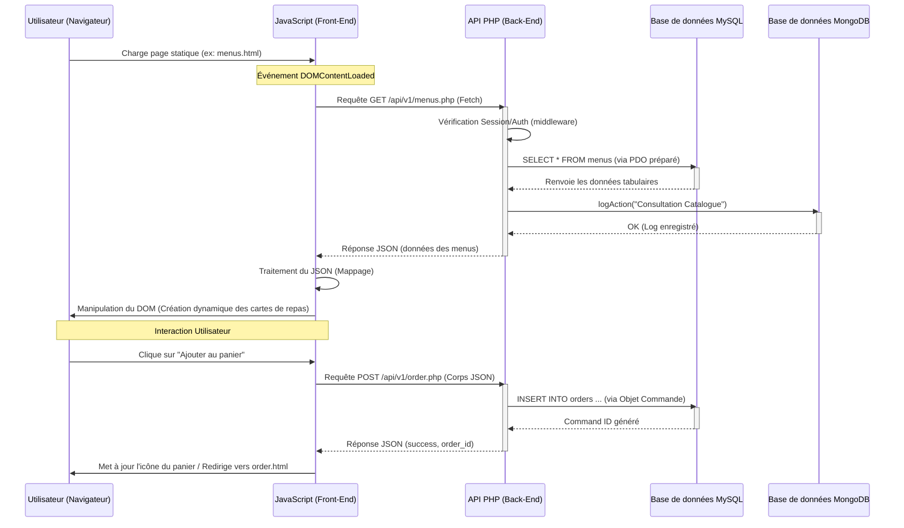

# Diagramme de Séquence : Architecture Fetch Front-End vers API Back-End

Ce diagramme illustre le flux typique de données entre les pages statiques (`.html`), le JavaScript local (`Fetch API`), et le backend PHP (Contrôleurs MVC connectés aux bases MySQL et MongoDB).

### Explications Architecturales
1. **Séparation des préoccupations (SoC)** : Le front-end ne connaît ni PHP ni SQL. Il se contente d'afficher le DOM et d'orchestrer les appels asynchrones `fetch`.
2. **Stateless vs Stateful** : Bien que l'API utilise des Sessions PHP (`$_SESSION`), toutes les transmissions de données textuelles et de formulaires se font en JSON pour être agnostiques par rapport à la technologie front.
3. **Usage Mixte BDD** : 
   - **MySQL** : Garantit l'intégrité relationnelle (Utilisateurs -> Commandes -> Menus).
   - **MongoDB** : Utilisé pour du logging d'action rapide et asynchrone sans bloquer la table relationnelle.
