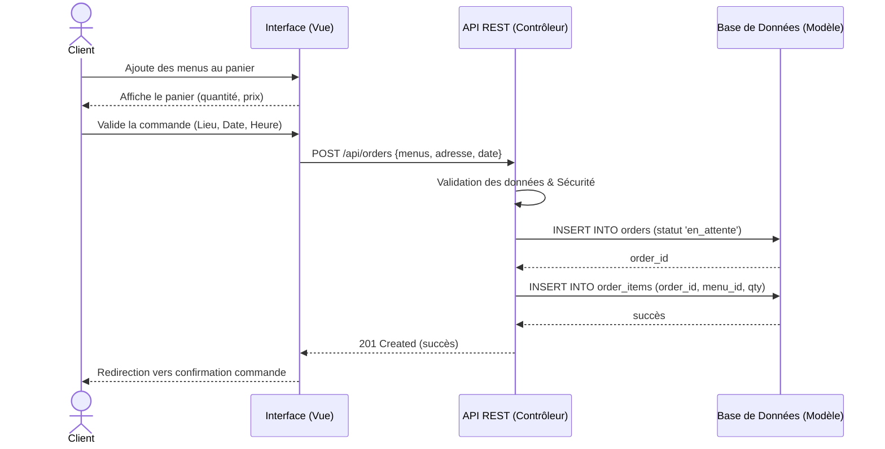

# Diagramme de Séquence : Parcours d'une Commande

```mermaid
sequenceDiagram
    actor Client
    participant Frontend as Interface (Vue)
    participant API as API REST (Contrôleur)
    participant DB as Base de Données (Modèle)

    Client->>Frontend: Ajoute des menus au panier
    Frontend-->>Client: Affiche le panier (quantité, prix)
    Client->>Frontend: Valide la commande (Lieu, Date, Heure)
    Frontend->>API: POST /api/orders {menus, adresse, date}
    
    API->>API: Validation des données & Sécurité
    API->>DB: INSERT INTO orders (statut 'en_attente')
    DB-->>API: order_id
    API->>DB: INSERT INTO order_items (order_id, menu_id, qty)
    DB-->>API: succès
    
    API-->>Frontend: 201 Created (succès)
    Frontend-->>Client: Redirection vers confirmation commande
```
